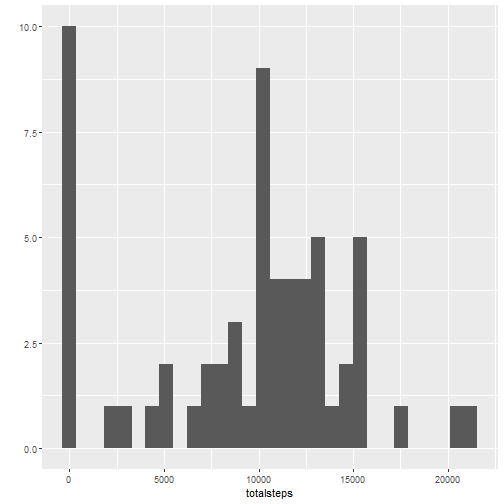
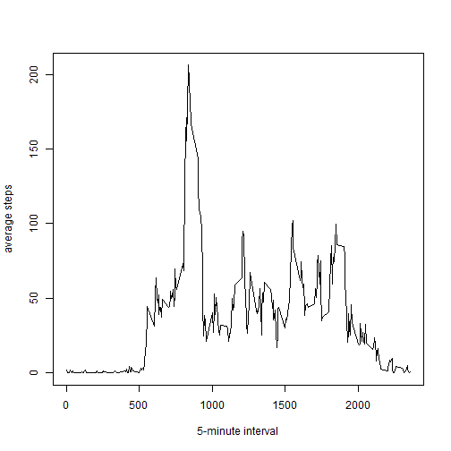
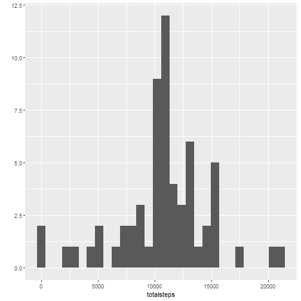
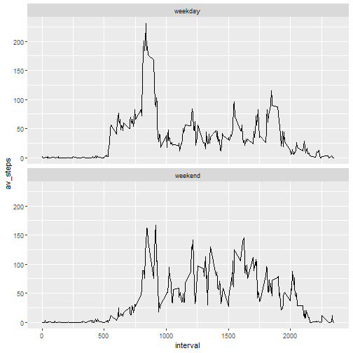

## Loading and Preprocessing the data
The following chunck of R code is to read the data from the disk.Except for NA, the data is clean, and consequently does not need preprocessing. The required preprocessing in done in each R code chunck.

```r
data <- read.csv("activity.csv")
library(dplyr)
```

```
## Warning: package 'dplyr' was built under R version 3.6.3
```

```
## 
## Attaching package: 'dplyr'
```

```
## The following objects are masked from 'package:stats':
## 
##     filter, lag
```

```
## The following objects are masked from 'package:base':
## 
##     intersect, setdiff, setequal, union
```

```r
library(lubridate)
```

```
## Warning: package 'lubridate' was built under R version 3.6.3
```

```
## 
## Attaching package: 'lubridate'
```

```
## The following objects are masked from 'package:dplyr':
## 
##     intersect, setdiff, union
```

```
## The following objects are masked from 'package:base':
## 
##     date, intersect, setdiff, union
```

```r
library(ggplot2)
```

```
## Warning: package 'ggplot2' was built under R version 3.6.3
```
## What is mean total number of steps taken per day?
The following chunck of R code calculates the total number of steps taken each day and ignores NA. Code can be implemented in different ways, but in this example piping was preferred.
The histogram of total steps taken each day can be plotted in different ways. Here qplot was used for the purpose.

```r
q1 <- data %>%
  group_by(yday(as.Date(date))) %>%                  # day-wise grouping to get mean of steps
  summarize(totalSteps = sum(steps, na.rm = TRUE)) 
names(q1) = c("yearday", "totalsteps")
qplot(totalsteps, data = q1)
```

```
## `stat_bin()` using `bins = 30`. Pick better value with `binwidth`.
```



```r
mean_Steps <- mean(q1$totalsteps)
median_Step <- median(q1$totalsteps)
```
## What is the average daily activity pattern?
Average daily pattern. Make a time series plot of the 5-minute interval and the average number of steps taken on average across all the days in the dataset. A line plot of a time series can be plotted in more than one way, i.e., using base plot, lattice, or ggplot. Here base plot is used.
maxstep_interval represents the 5-min interval that contains the maximum number of steps.

```r
q2 <- data %>%
  group_by(interval) %>%
  summarize(averageSteps = mean(steps, na.rm = TRUE))
names(q2) = c("interval","averagesteps")
# qplot(interval, averagesteps, data = q2, geom = c("point","line"))
plot(q2$interval, q2$averagesteps, type = "l", xlab = "5-minute interval", ylab = "average steps")
```



```r
idx <- which(max(q2$averagesteps)==q2$averagesteps)
maxstep_interval = q2$interval[idx]               # 5-min interval containing max steps
rm(idx)
```
## Imputing missing values

```r
Total_na = sum(is.na(data))                      # total number of missing values
q3 <- data %>%
  group_by(interval) %>%
  summarize(for_NA = mean(steps, na.rm = TRUE))  # values to replace NA
new_data <- data
idx_na <- (is.na(new_data$steps))
for (i in 1:length(q3$interval)){
  idx <- new_data$interval == q3$interval[i] & idx_na
  new_data$steps[idx] <- q3$for_NA[i]
}
q3_4 <- new_data %>%
  group_by(yday(as.Date(date))) %>%                  # day-wise grouping to get mean of steps
  summarize(total_steps = sum(steps)) 
names(q3_4) = c("yearday", "totalsteps")
qplot(totalsteps, data = q3_4)
```

```
## `stat_bin()` using `bins = 30`. Pick better value with `binwidth`.
```



```r
print(c('The mean of the steps taken is', mean(q3_4$totalsteps)))
```

```
## [1] "The mean of the steps taken is" "10766.1886792453"
```

```r
median_Step1 <- median(q3_4$totalsteps)
```
Both mean and median of total steps taken each day of new dataset (i.e., when NA were filled with mean values) slightly differ from the values calculated using original dataset (i.e., when NA were discarded). 
The imapct of addressing NA using mean of the values makes histogram bit smoother, which can be seen by comparing histograms of part 1 and part3. 
## Are there differences in activity patterns between weekdays and weekends?

```r
q4 <- new_data %>%
  mutate(Day = weekdays(as.Date(date)))
idx_day <- (q4$Day == "Saturday" | q4$Day == "Sunday")
q4$Day[idx_day] = "weekend"
q4$Day[!idx_day] = "weekday"
q_weekend <- q4 %>%
  filter(Day == "weekend") %>%
  group_by(interval) %>%
  summarize(av_steps = mean(steps)) %>%
  mutate(Day = "weekend")
q_weekday <- q4 %>%
  filter(Day == "weekday") %>%
  group_by(interval) %>%
  summarize(av_steps = mean(steps)) %>%
  mutate(Day = "weekday")
q4_b <- bind_rows(q_weekend,q_weekday)
qplot(interval, av_steps, data = q4_b, geom = c("line","line")) + facet_wrap(~Day, ncol = 1, nrow = 2)
```



